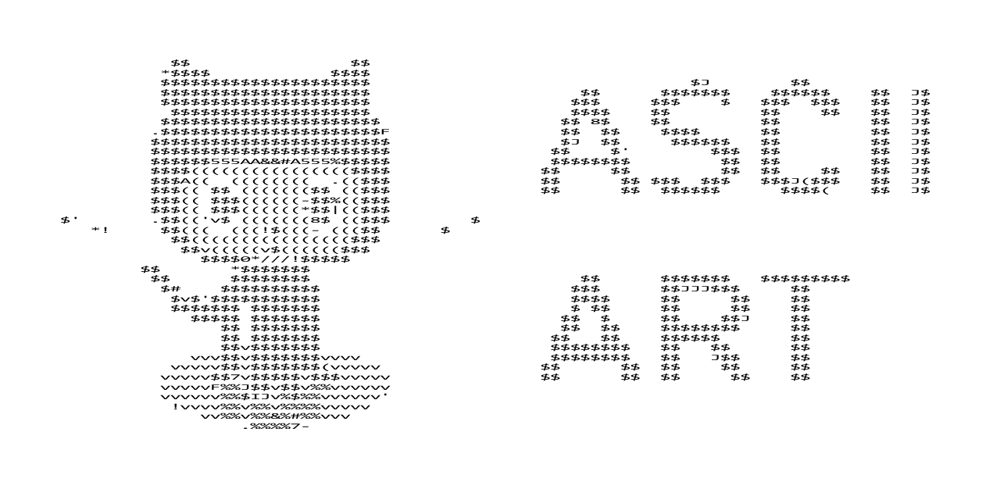

# Description
Named as such, this package is a command-line ASCII art generator written in Python. There is a variety of customization parameters which are detailed below.

# Installation
With Git installed, simply clone the repository using the command:
```
git clone https://github.com/dawsonbooth/ascii-art.git
```
# Usage
This is a command-line program. The main file, ```ascii_art.py``` can be executed as follows: 
```
python ascii_art.py [-h] [--output OUTPUT] [--width WIDTH] [--height HEIGHT] [--chars CHARS] [--invert] [--normalize] [--terminal] input
```

Positional arguments:
```
input: Path to image from which ASCII art will be generated
```

Optional arguments:
```
  -h, --help        Show the help message and exit
  --output OUTPUT   Path to output generated ASCII art
  --width WIDTH     Character width of ASCII art
  --height HEIGHT   Character height of ASCII art
  --chars CHARS     Path to characters to be seen in ASCII art
  --invert          Whether the ASCII output color is inverted
  --normalize       Whether the weights of the provided ASCII characters are normalized
  --terminal        Whether to output to the terminal
  ```
Example:
```
python ascii_art.py examples/images/einstein.jpg --width 60 --height 30 --terminal --invert --normalize
```
```
+????+??++++++++;'+?+?%?%%#%%###%%%%%%%%%????%%+%.
?????+?+++++++;;+?%;%%?%%##%%#%#%#####%%%%?%?%%%?+         .
????+?+++++;;;;+++????%%@####@#####%#%%#%%%?%?%%%+?      .
??+?+?++++;+;??%?+;?%%##@@########%##%%%%%%%%?%%%?..'   .
??+??+?+;;;;%'+?+?'???#%@@#####@#####%#%%%%%%%%%%??  +  .  .
?+????+++;;?'??++?+?''??###%##%%???++#%%%%%%%%%%??;+  '
?+?????++;;?.+?'+%.?%%%%#####@@@#%##%#%%%%#%%%#%???.+ '.   .
;??+???+;?;''+?;??;%%%%%%#@@@@%######%%%%%%%%%#%%?+??+
????+?+;;'';'?++?;?%%+?%%?#@@#%%%%?%?#%%%%%%%%%%%%?+??.
%???+++'''.'.%';?;???#.?+%%@#%?%?@?'?%%%%%%?%%%%%?%+??+?
??+?+;;'.. .+?;;?;+%?%'%?+%#%%#???.;?%%%%%%%%%%%%%?????..
?;;+;;'..'''.%.;+;+?+?%%?;%%%%%?%????%?%%%%%%%%???????;+ ;
%;;;;;'... '?;.'';???%?%'?%%%%%%%?%%%%%%%%%?%????'??%??+' .
%. .;';.....'+...+%%%%%%+%%%?%%###%#%%%%%%????%?%+?+??%??''
?    '....;..'.;.;%%%%%'%%#%?%%#####%#%#%%%???%%%%?;?%%?%..
;    ..'.'....;'.;%%%%#'%@@#%%?#@###@#%%??????#%%??%?%%?%;
; .. ..  '.....'';%?%@;;?#%%%%%%%#@#@#%%%+????%%??#%?#%+?+'
+.  .. ... .?.'+.;?%#%%%++?%%%%##?###%%%%+???##??%%%%#%+?+;
+  #.;.'    . .'.??%%?#@%%%%%##%%%?#%%##%????%%+??%?#%?;?' .
+   .... ......'.+?????#?###%?%%#%%%%%##??%?+%%?'%?%+%%+ ...
.    +'. ........'??+;%%??%%%%%%%%%%#%%%??%?+?.  .;+.+;.....
   .      .. .....++#?;.+?'+???++?#%#%%%%?%?;      .. .....'
       .  ........?%%#???%%?%%?'??%%%%#%?%%      .  ..... '?
        .. ....'...%+@%?%%%%?#+??#%%%%#%%?         ... . '??
       .............%##'#%??????%##%?#%+?           .  .';++
      ;+''......'''.?%%.%%??%??%%###%#%..          . ..++;+'
    +;+;+''...'.''''.?%.??%???%#%##%#%      . .  . ..'++'+?+
  +;;;+;;;;'''.'''''..?%.?%%;#####%%.....   .... .. ;++?;+;'
;+++;+;;++;;'.''''''...??.?;#@#%##+.... .  ..'...  ;;;++;;;.
++++;?+;+?+;'''''''''...??%#####?........ .'... ..'+;;++?+.'
```